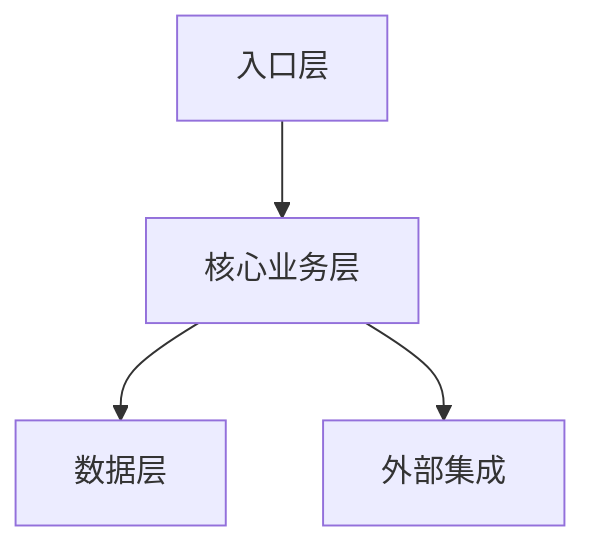
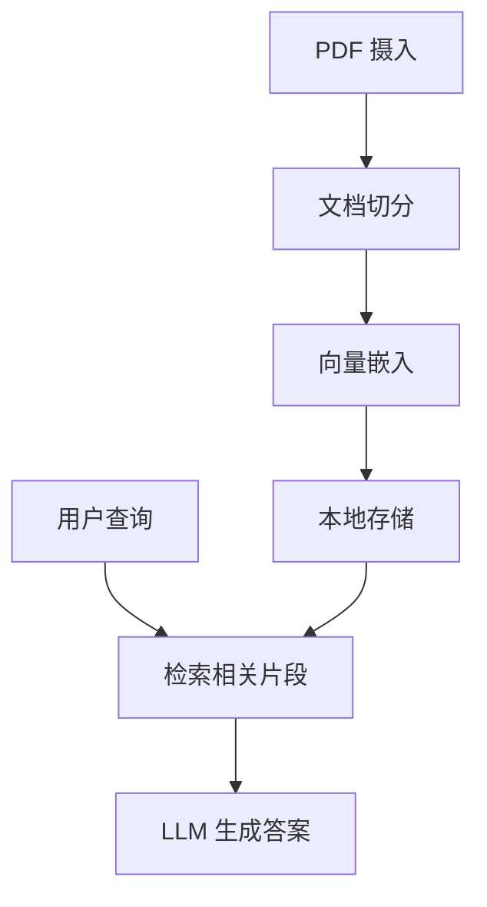

# Professional README Generator

为仓库生成**专业、有深度、高大上**的 README 文档。不仅提供信息，更展现项目的专业度和技术品味。

**调用时机**：当用户需要为项目创建或更新 README 文档时。

**输出产物**：项目根目录下的 `README.md` 文件。

---

## 设计原则

### 专业但不刻板
- 使用精心挑选的 emoji 增加活力，但不过度使用
- 加入认证标识（Badges）展示项目成熟度
- 语言专业但不失亲和力

### 深度但不晦涩
- 从整体架构思路解析，而非罗列技术细节
- 突出设计理念和解决的核心问题
- 展示项目的价值主张

### 实用但不简陋
- 提供清晰的运行方式
- 包含必要的配置说明
- 用可视化方式展示架构

---

## README 结构模板

### 1. 头部 Hero Section

```markdown
# 🚀 Project Name

> 🌟 **中二标语**（可选，视项目调性而定）："一句话概括项目的牛逼之处"

[](LICENSE)
[](package.json)
[]()
[]()
[]()

---
```

### 2. 项目简介

```markdown
## 📋 项目概述

**一句话精确定位**：[用一句话说明这个项目是做什么的，解决什么问题]

**核心价值主张**：
- ✨ **亮点1**：为什么这个项目值得关注
- 🎯 **亮点2**：解决了什么痛点
- 🚀 **亮点3**：独特的技术/设计优势

**适用场景**：
- 场景 A
- 场景 B
- 场景 C
```

### 3. 架构设计（核心部分）

```markdown
## 🏗️ 架构设计

### 设计理念

**核心原则**：
- 原则 1：如"关注点分离"、"配置驱动"等
- 原则 2：如"渐进式增强"、"容错优先"等
- 原则 3：...

### 整体架构



**架构层次说明**：

| 层次 | 职责 | 关键文件 |
|------|------|----------|
| **入口层** | 处理请求、路由分发 | `src/main.ts`、`src/server.ts` |
| **核心业务层** | 领域逻辑、核心算法 | `src/core/`、`src/services/` |
| **数据层** | 数据持久化、缓存 | `src/store/`、`src/database/` |
| **外部集成** | 第三方 API、SDK | `src/integrations/` |

### 核心流程

```
用户请求 → 验证与鉴权 → 业务处理 → 数据操作 → 响应返回
     ↓          ↓           ↓          ↓          ↓
   入口层    中间件层    业务层     数据层     响应层
```
```

### 4. 快速开始

```markdown
## 🚀 快速开始

### 前置要求

| 依赖 | 版本要求 |
|------|----------|
| Node.js | ≥ 18.x |
| pnpm | ≥ 8.x |
| ... | ... |

### 安装与运行

```bash
# 1. 克隆仓库
git clone <repo-url>
cd <project-name>

# 2. 安装依赖
pnpm install

# 3. 配置环境
cp .env.example .env
# 编辑 .env，填入必要配置

# 4. 启动项目
pnpm dev
```

### 验证安装

访问 `http://localhost:3000` 或运行：

```bash
pnpm test
```
```

### 5. 项目结构

```markdown
## 📁 项目结构

```
<project-name>/
├── src/
│   ├── core/          # 核心业务逻辑
│   ├── services/      # 服务层
│   ├── utils/         # 工具函数
│   └── types/         # 类型定义
├── packages/          # Monorepo 包（如适用）
├── docs/              # 文档
└── README.md
```

**关键目录说明**：
- `src/core/` - 核心领域逻辑，项目的"大脑"
- `src/services/` - 应用服务，编排核心逻辑
- `packages/` - 可复用的独立模块
```

### 6. 主要功能

```markdown
## ✨ 主要功能

### 功能模块 A
- 功能描述 1
- 功能描述 2

### 功能模块 B
- 功能描述 1
- 功能描述 2
```

### 7. 配置说明

```markdown
## ⚙️ 配置说明

| 环境变量 | 说明 | 默认值 |
|----------|------|--------|
| `NODE_ENV` | 运行环境 | `development` |
| `PORT` | 服务端口 | `3000` |
| ... | ... | ... |
```

### 8. 开发指南

```markdown
## 👨‍💻 开发指南

### 代码规范
- 遵循 [ESLint 配置](.eslintrc)
- 使用 Prettier 格式化代码
- 提交前运行 `pnpm lint`

### 提交规范
- feat: 新功能
- fix: 修复 bug
- docs: 文档更新
- refactor: 重构
```

### 9. 贡献指南

```markdown
## 🤝 贡献指南

欢迎提交 Issue 和 PR！

1. Fork 本仓库
2. 创建特性分支 (`git checkout -b feature/AmazingFeature`)
3. 提交更改 (`git commit -m 'feat: Add some AmazingFeature'`)
4. 推送到分支 (`git push origin feature/AmazingFeature`)
5. 开启 Pull Request
```

### 10. 许可证与致谢

```markdown
## 📄 许可证

本项目采用 [MIT License](LICENSE) 开源。

---

## 🙏 致谢

感谢以下开源项目的启发：
- [Project A](link)
- [Project B](link)

---

<p align="center">
Made with ❤️ by [Your Name/Team]
</p>
```

---

## 生成流程

### 第一步：项目分析

1. 读取 `package.json` 或其他配置文件获取项目基本信息
2. 分析项目结构，识别核心目录和文件
3. 理解技术栈和关键依赖
4. 识别架构模式和设计理念

### 第二步：内容生成

1. **Hero Section**：根据项目调性决定是否加中二标语
2. **项目简介**：提炼核心价值，避免技术堆砌
3. **架构设计**：从整体思路解析，展示设计智慧
4. **快速开始**：提供可复制粘贴的步骤
5. **其他章节**：按需补充

### 第三步：质量检查

- [ ] Badges 完整且正确
- [ ] 架构描述清晰，有 Mermaid 图
- [ ] 快速开始步骤可执行
- [ ] 语言专业但不晦涩
- [ ] Emoji 使用恰当，不过度
- [ ] 无明显技术细节堆砌

---

## 调用协议

```
1. 用户请求生成 README
2. 分析项目结构和代码
3. 按上述模板生成 README.md
4. 保存到项目根目录
5. 报告完成
```

---

## 示例输出（节选）

```markdown
# 🚀 LangChain PDF Knowledge Base

> 🌟 "让 PDF 知识触手可及——企业级 RAG 解决方案"

[](LICENSE)
[](package.json)
[]()
[]()

---

## 📋 项目概述

**一句话精确定位**：基于 LangChain 的企业级 PDF 知识库 RAG 系统，让文档智能检索和问答变得简单。

**核心价值主张**：
- ✨ **零配置启动**：开箱即用，无需复杂设置
- 🎯 **自适应嵌入**：根据文档长度智能选择嵌入策略
- 🚀 **本地持久化**：无需向量数据库，数据本地存储

---

## 🏗️ 架构设计

### 设计理念

**核心原则**：
- **渐进式复杂**：默认简单，需要时可扩展
- **配置驱动**：行为通过配置控制，而非硬编码
- **容错优先**：优雅处理边缘情况，不轻易崩溃

### 整体架构



...（继续其他章节）
```

---

## 关键注意事项

1. **不要**：堆砌技术细节（如"我们用了 React 18 的 useTransition hook"）
2. **要**：展示设计思路（如"我们采用了流式渲染以提升用户体验"）
3. **不要**：用"我们实现了 X"，要用"X 是这样工作的"
4. **要**：让读者看完觉得"这个项目设计得真巧妙"
5. **Badges 选择**：根据项目实际情况选择相关的 badges，不要硬加
